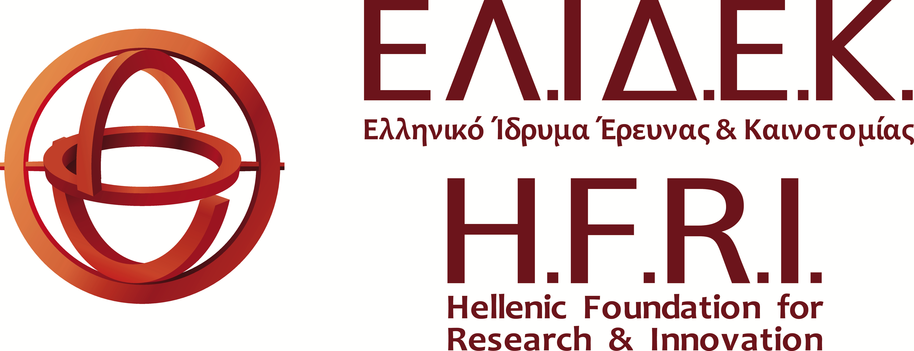

# DMC - Lexi Dataset

This repository hosts the structured open-access dataset and associated materials for the project:

> [**Digital Manuscripts of Cyril's Lexicon (DMC Lexi)**](https://cyril-lexicon.aegean.gr/)  
> Funded by the Hellenic Foundation for Research and Innovation (H.F.R.I.) through the European Union – NextGenerationEU.
> Project ID: 014890 

The dataset is part of a wider initiative to lay the groundwork for a comprehensive edition of **Cyril of Alexandria’s Lexicon**, combining encoded manuscript transcriptions, segmentation metadata, and image-text alignment tools.

---

## Contents
The Dataset consists of 
- CSV files with transcriptions of three manuscripts of Cyril's *Lexicon* together with their metadata. The transcriptions have been produced manually during the Project and the manuscripts are otherwise unedited and unpublished. Each transcribed segment is labelled as either lemma or definition. The files contain structured data by manuscript, line, and lexical function. 
- Images of one of the manuscripts (*Athens, National Library of Greece (EBE) 1082*) along with positional coordinates (bounding boxes) that map the transcribed text segments to their corresponding regions on the manuscript image.


---

## Manuscript Sources
This is an ongoing project. The manuscripts avaailable in v.1 are:

- *Mount Athos, Xiropotamou Monastery 93 (Lambros 2426)* – 16th century
- *Athens, National Library of Greece (EBE) 1082* – 15th century, ff. 1–167
- *Deskati (Zaborda), Saint Nikanor Monastery 95* – 13th century, ff. 57–76

---

## Citation

Please cite this dataset as follows:

```bibtex
@dataset{konstantinidou2025dmc,
  author       = {Maria Konstantinidou and Stamatios Busses and Despoina Ioakeimidou and Emmanuil Gkinidis and Stavros N. Moutsis and Elpida Perdiki and Dimitrios Agoris and Ioannis Kouroudis and Athina Mega and Apostolia Tepetzi and Nikolaos Tsoukatos and Maria Fragkopoulou and Panayotis Nastou and Antonis Tsolomitis},
  title        = {DMC Lexi Dataset: Image - text aligned transcription of Cyril of Alexandria's Greek Manuscripts},
  year         = {2025},
  version      = {1.0.0},
  url          = {https://github.com/mkons/DMC-Lexi},
  note         = {Funded by the Hellenic Foundation for Research and Innovation (H.F.R.I.), Grant ID 014890}
}
```

Alternatively (APA-style):

> Konstantinidou, M., Busses, S., Ioakeimidou, D., et al. (2025). *DMC Lexi Dataset: Image - text aligned transcription of Cyril of Alexandria's Greek Manuscripts* (v1.0.0). [Dataset]. GitHub. https://github.com/mkons/DMC-Lexi

---

## Technical Details

- All data are UTF-8 encoded (see `.gitattributes`)
- Lemmata and definitions exported in `.csv` format
- Segmentations align image coordinates with text regions
- TEI encoding guidelines referenced in `README_DATA.md`
- Line endings normalized for cross-platform compatibility

---

## License

All materials in this repository are distributed under a [Creative Commons Attribution 4.0 International License (CC BY 4.0)](https://creativecommons.org/licenses/by/4.0/).

**Note:** Due to copyright restrictions, manuscript images may not be included in full. For access, contact:  
dmc@helit.duth.gr

---

## Acknowledegments

<p align="center">
  <a href="https://www.elidek.gr/">
    
  </a>
   &nbsp;&nbsp;&nbsp;&nbsp;&nbsp;
  <a href="https://greece20.gov.gr">
    
  </a>
</p>

This project is carried out within the framework of the **National Recovery and Resilience Plan Greece 2.0**, funded by the **European Union – NextGenerationEU**.  
Implementation Body: **H.F.R.I.**  
**Project Duration:** 01/01/2024 – 31/12/2025  
**Grant ID:** 014890

---

## Contact & More Info

Project Lead: Dr. Maria Konstantinidou  
Institution: Democritus University of Thrace  
For questions or collaborations, contact: **dmc@helit.duth.gr**
